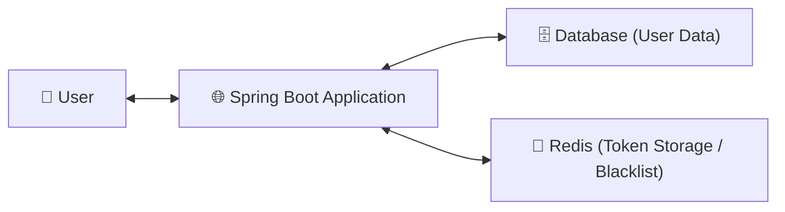

# 🚀 Spring Security + JWT Authentication Template

> 간결하고 확장 가능한 **Spring Boot 3.x 기반 인증/인가 템플릿**  
> `Package by Feature` 구조로 구성되어 있으며, **JwtFilter 기반 인증 흐름**을 제공합니다.

---

## 🧰 Tech Stack

| Category | Stack                         |
|-----------|-------------------------------|
| Language | Java 17                       |
| Framework | Spring Boot 3.2.x             |
| Build Tool | Gradle 8.2+                   |
| Security | Spring Security, JWT          |
| Database | MySQL(정보저장), Redis (블랙리스트 관리) |
| Validation | Jakarta Validation            |
| Etc | Lombok, Jackson               |

---

## 🏗️ Architecture

### 📦 Package by Feature 구조
```
org.example.securityjwttemplate
├── common
│ ├── jwt # JWT 유틸, 필터, 인증 정보
│ ├── exception # 공통 에러 포멧(BizException
│ └── response # 공통 응답 포맷(ApiResponse)
├── config
│ └── SecurityConfig.java
└── domain
  ├── auth # 로그인, 로그아웃, 토큰 재발급
  └── users # 사용자 CRUD, 프로필 조회/수정

```

### 🧩 System Architecture (Mermaid Diagram)




## 📡 API 명세

### 🧾 AuthController (`/api/v3/auth`)

| Method | Endpoint | Description | Request | Response |
|--------|-----------|--------------|----------|-----------|
| `POST` | `/login` | 로그인 | `LoginRequest` | `TokenResponse` |
| `POST` | `/logout` | 로그아웃 | Header(Token) | - |
| `POST` | `/reissue` | 토큰 재발급 | Header(Refresh Token) | `TokenResponse` |

### 👤 UserController (`/api/v3/users`)

| Method | Endpoint | Description | Request | Response |
|--------|-----------|--------------|----------|-----------|
| `POST` | `/` | 회원가입 | `UserCreateRequest` | - |
| `GET` | `/me` | 내 정보 조회 | JWT 인증 필요 | `UserResponse` |
| `PATCH` | `/` | 회원 정보 수정 | `UserUpdateRequest` | - |
| `DELETE` | `/` | 회원 탈퇴 | JWT 인증 필요 | - |

---

## 🧠 ERD


---

## 🪃 요청 시퀀스다이어그램


---

## 📘 인증 요청 & 응답 예시
### 🔸 로그인 요청
```json
// POST /api/v3/auth/login
// Content-Type: application/json

{
    "email": "test@example.com",
    "password": "1234"
}
```

### 🔹 로그인 성공 응답
```json
{
    "status": "SUCCESS",
    "code": "S200",
    "message": "로그인 성공",
    "data": {
        "accessToken": "eyJhbGciOiJIUzI1NiIs...",
        "refreshToken": "eyJhbGciOiJIUzI1NiIs..."
    }
}
```
## 🧑‍💻 인증된 사용자 정보 주입 예시
```java
@GetMapping("/me")
public ResponseEntity<ApiResponse<UserResponse>> findById(@AuthenticationPrincipal UserAuth userAuth) {
    UserResponse response = userService.findById(userAuth);
    return ResponseEntity.ok(ApiResponse.success("회원 조회 성공", response));
}
```
